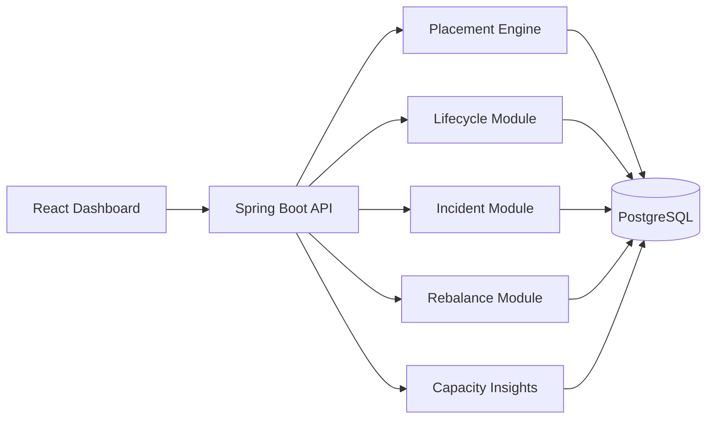

# Architecture

## Current Target

Stratus Lite starts as a modular monolith plus a React dashboard. This keeps the 3-day project shippable while preserving clear service boundaries inside the backend.

## Backend Modules

- `fleet`: cells, regions, capacity accounting, health state
- `workloads`: tenants, workload requests, lifecycle state
- `placement`: filter, scoring, bind, placement explanations
- `incidents`: overload/failure simulation and incident records
- `rebalance`: migration recommendations, execution history, and rollback
- `audit`: persisted control-plane event timeline
- `insights`: aggregate fleet risk and capacity posture

The backend keeps domain records separate from persistence details. Services operate on immutable domain objects, while JDBC repositories map those objects to PostgreSQL tables. This keeps the placement logic easy to unit test and keeps database concerns at the module boundary.

## Local-First Design

Everything should run locally through Docker Compose. Cloud deployment is a future roadmap item, not part of the 3-day MVP.

## Future Roadmap

After the MVP is complete, Stratus Lite can evolve toward the full Stratus plan:

- Split modules into services.
- Add Kafka for lifecycle events.
- Add Redis locks/cache for multi-instance coordination.
- Add OpenTelemetry, Prometheus, and Grafana.
- Add Kubernetes manifests.
- Add ILP optimization for batch placement.
