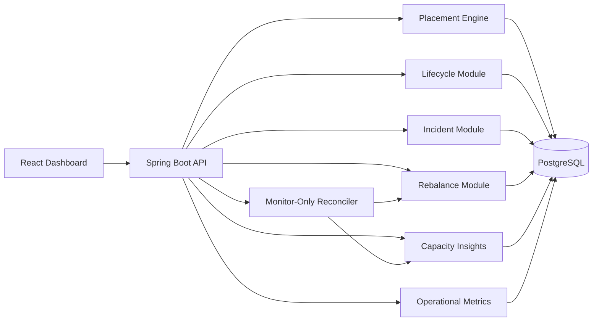

# Architecture

## Current Target

Stratus Lite is a modular monolith plus a React dashboard. This keeps local development simple while preserving clear service boundaries inside the backend.

## Backend Modules

- `fleet`: cells, regions, capacity accounting, health state
- `workloads`: tenants, workload requests, lifecycle state
- `placement`: filter, scoring, bind, placement explanations
- `incidents`: overload/failure simulation and incident records
- `rebalance`: migration recommendations, execution history, and rollback
- `audit`: persisted control-plane event timeline
- `insights`: aggregate fleet risk and capacity posture
- `reconciler`: monitor-only control loop that detects pending recovery work
- `observability`: operational metrics for decisions, migrations, incidents, and audit activity

The backend keeps domain records separate from persistence details. Services operate on immutable domain objects, while JDBC repositories map those objects to PostgreSQL tables. This keeps the placement logic easy to unit test and keeps database concerns at the module boundary.

## Control Loop

The reconciler runs in monitor-only mode. It periodically reads capacity risk, pending rebalance recommendations, and active migrations. It does not execute migrations automatically. Instead, it records its latest decision as one of:

- `STEADY`: no pending move and no active migration
- `ACTION_REQUIRED`: one or more rebalance recommendations need operator approval
- `MIGRATION_ACTIVE`: migration work is in progress and should be monitored

This keeps the demo close to real control-plane design: automated detection, explicit execution, explainable audit history.

## Observability

The metrics endpoint summarizes the operational surface area:

- workload requests and active workloads
- placement decisions and rejected placement candidates
- pending recommendations and migration history
- incidents, recent audit events, max utilization, and risk score

## Local-First Design

Everything runs locally through Docker Compose. Cloud deployment is a future roadmap item, not part of the current local-first scope.

## Future Roadmap

Stratus Lite can evolve toward a larger distributed control-plane architecture:

- Split modules into services.
- Add Kafka for lifecycle events.
- Add Redis locks/cache for multi-instance coordination.
- Add OpenTelemetry, Prometheus, and Grafana.
- Add Kubernetes manifests.
- Add ILP optimization for batch placement.
